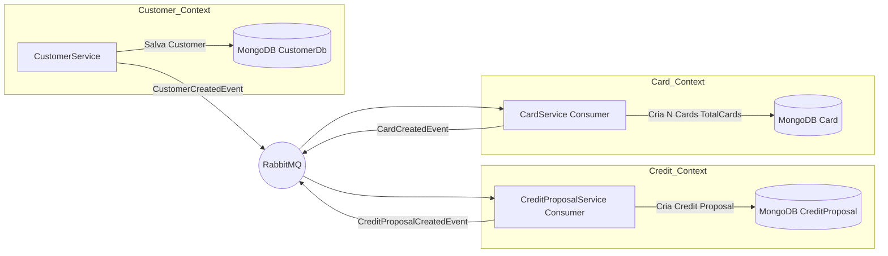

```mermaid
flowchart LR

subgraph Customer_Context
A[CustomerService]
A_DB[(MongoDB CustomerDb)]
end

B((RabbitMQ))

subgraph Credit_Context
C[CreditProposalService Consumer]
C_DB[(MongoDB CreditProposal)]
end

subgraph Card_Context
E[CardService Consumer]
E_DB[(MongoDB Card)]
end

%% Flow

A -->|Salva Customer| A_DB
A -->|CustomerCreatedEvent| B

B --> C
C -->|Cria Credit Proposal| C_DB
C -->|CreditProposalCreatedEvent| B

B --> E
E -->|Cria N Cards TotalCards| E_DB
E -->|CardCreatedEvent| B
```
